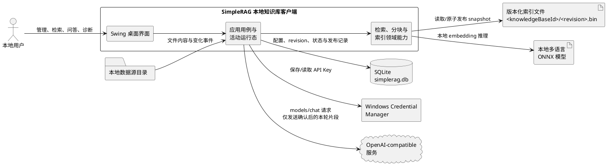
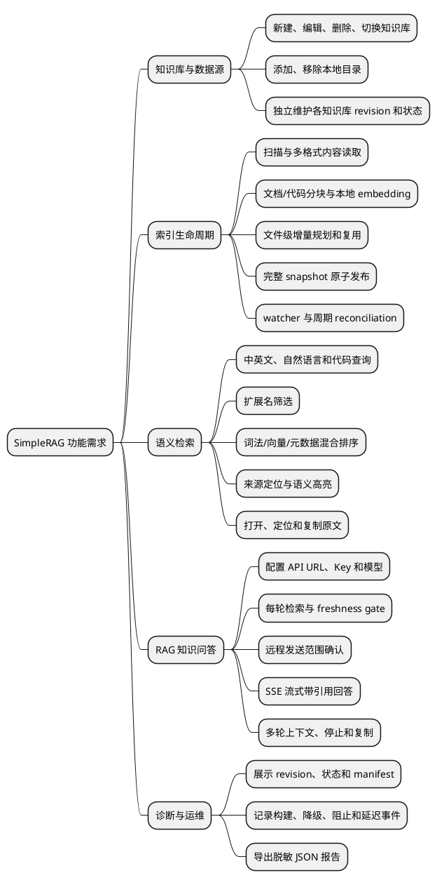
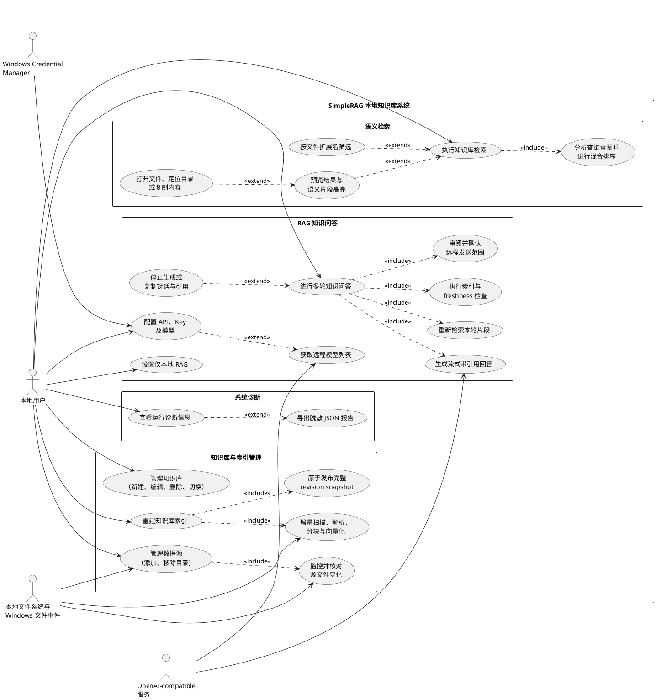
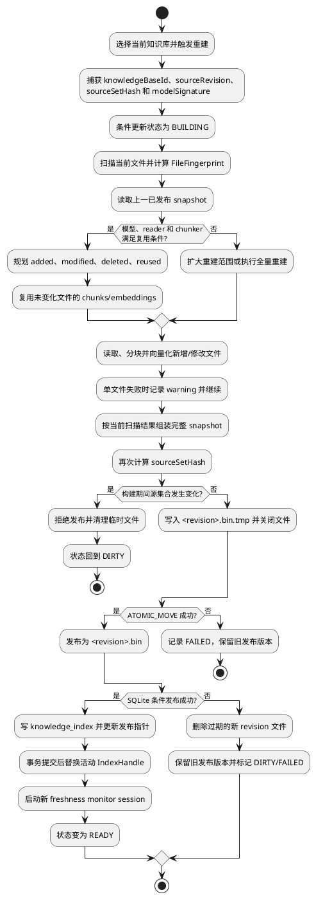
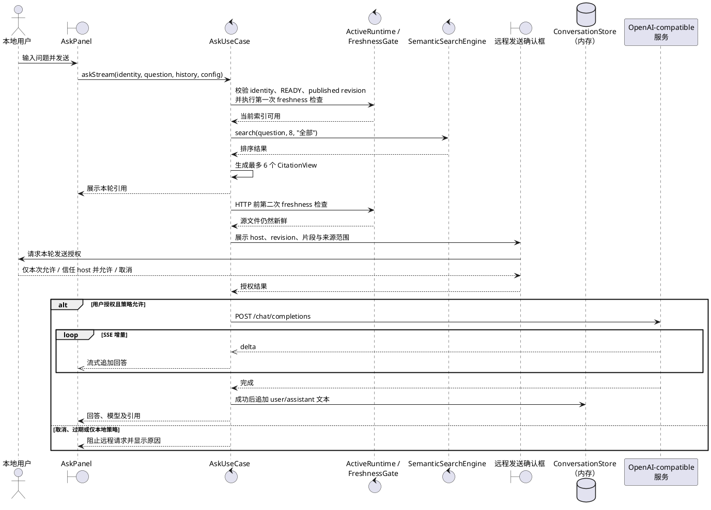
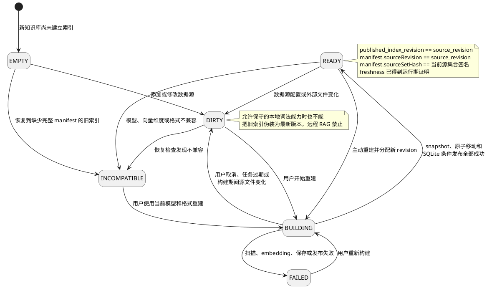
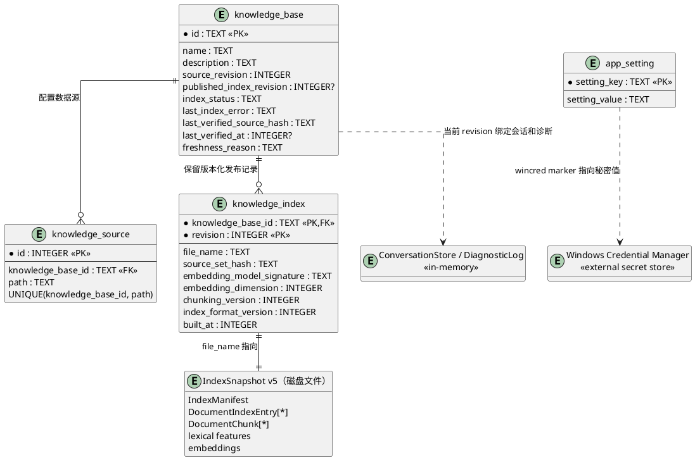

# 2. 需求分析

需求分析是系统设计与实现的基础。本章结合 SimpleRAG 的实际代码、[`README.md`](../README.md)、[`DEVELOPMENT.md`](../DEVELOPMENT.md)、[`docs/REQUIREMENTS_TRACEABILITY.md`](REQUIREMENTS_TRACEABILITY.md)、架构决策记录以及敏捷产品文档，对系统的建设目标、参与者、系统边界、功能需求、数据需求、业务规则、非功能需求和验收条件进行分析。分析内容以当前已经实现并有测试证据支持的能力为主，同时明确 OCR、云同步和多用户服务端部署等暂不属于当前版本的内容，避免将规划功能与现有需求混淆。

## （1）总体需求分析

### 1.1 需求背景与建设目标

个人项目、课程资料和软件工程资料通常分散在源代码、Markdown、配置文件、PDF 以及 Office 文档中。传统文件名搜索难以发现表达方式不同但语义相近的内容，直接使用远程大模型又可能产生资料泄露、回答缺少出处和文件变化后引用过期等问题。因此，SimpleRAG 需要提供一个面向个人计算机的本地知识库工作区，在尽量不改变用户原有目录结构的前提下，对多种本地资料建立可验证的版本化索引，并同时提供词法检索、语义检索和带来源的 RAG 问答能力。

系统建设目标可以概括为四个方面。首先，系统需要保证文档扫描、解析、分块、TF-IDF 特征、ONNX embedding 和索引持久化默认在本地完成。其次，检索结果和模型回答必须保留文件路径及页码、章节、幻灯片、工作表或行号，使用户能够回到原文核验。再次，源文件发生变化后旧索引必须及时失效，新索引只能通过完整 revision snapshot 和原子发布流程成为活动版本。最后，远程问答只能发送本轮必要的召回片段，并在每次发送前向用户展示目标服务和准确的数据范围。

### 1.2 参与者与相关外部系统

SimpleRAG 是单用户桌面应用，主要参与者为本地用户，不划分系统管理员、知识库管理员和普通用户等多级角色。本地用户负责创建和切换知识库、配置数据源、触发索引构建、执行检索、发起知识问答、审阅远程发送范围以及查看诊断信息。系统同时需要与若干外部环境协作：本地文件系统提供源文件和目录变化事件；本地 ONNX 模型提供 384 维多语言 embedding；SQLite 保存知识库、数据源、revision、索引发布记录和应用设置；Windows Credential Manager 保存当前用户的 API Key；OpenAI-compatible 服务提供模型列表和聊天补全能力。上述外部环境均不属于 SimpleRAG 内部业务逻辑，但会影响部分用例能否成功完成。

### 1.3 系统边界与上下文

图 2-1 展示了 SimpleRAG 的系统上下文。系统边界以内是 Swing 桌面界面、应用用例、活动运行态以及检索和索引领域能力；边界以外是用户、本地数据源、数据库、索引文件、模型、系统凭据服务和远程模型服务。该图说明文档内容首先在本地进入索引和检索流程，只有知识问答用例通过索引状态检查、freshness 检查和用户确认后，才会将少量召回片段发送至 OpenAI-compatible 服务。SQLite 中的发布指针与磁盘 snapshot 相互关联，但二者不能替代对方，系统必须同时验证它们的 revision 和 manifest 才能把索引视为有效。

### 1.4 典型业务场景

在首次使用场景中，用户启动应用后创建知识库，添加一个或多个本地目录，并执行索引重建。系统扫描可支持文件，按照 reader 类型解析内容，使用文档或代码分块策略生成片段，在本地计算词法特征和 embedding，最后发布完整的 revision snapshot。索引进入 `READY` 后，用户可以输入中文、英文、代码标识符或自然语言问题进行检索，也可以在完成 API 配置后发起带引用问答。

在持续使用场景中，系统通过递归文件监听和周期性完整 reconciliation 检测当前知识库的变化。只要源文件被创建、修改或删除，旧索引就被标记为 `DIRTY`，远程 RAG 随即被阻止。用户重新构建时，系统只重新读取、分块和向量化新增或修改的文件，复用未变化文件的片段和 embedding，但发布结果仍然是包含全部当前文件的完整 snapshot。这样既减少重复计算，又避免删除文件留下“幽灵片段”。

在知识问答场景中，系统每轮重新检索当前问题，选择最多 6 个相关片段，显示文件路径和来源位置，并在远程 HTTP 请求之前再次验证索引和源文件状态。用户确认发送后，系统通过 SSE 流式显示回答，并要求模型使用 `[1]`、`[2]` 等编号引用本轮资料。历史对话仅用于理解追问中的指代，回答中的可验证事实仍必须由本轮重新召回的资料支持。

## （2）功能性需求

### 2.1 功能结构分析

图 2-2 对系统功能进行了分解。知识库与数据源管理负责确定资料范围；索引生命周期负责把资料转换为可检索且具有 revision 身份的完整快照；语义检索负责查询分析、混合排序和来源定位；RAG 知识问答在本地检索结果之上增加远程生成、多轮上下文和发送授权；诊断功能则提供状态、失败原因和性能事件。各功能并非彼此孤立，例如检索和问答都依赖当前活动索引，而远程问答还额外依赖 `READY` 状态、运行期 freshness 证明和用户授权。

### 2.2 系统用例图

图 2-3 是系统用例图。主要参与者“本地用户”可以直接发起知识库管理、数据源管理、索引重建、语义检索、API 配置、知识问答和诊断等用例。本地文件系统参与数据源读取、增量扫描和 freshness 监控；Windows Credential Manager 参与 API Key 的保存和读取；OpenAI-compatible 服务参与模型列表查询和回答生成。图中的 `include` 表示主用例必然包含的步骤，例如知识问答必须重新检索本轮资料、执行 freshness 检查并审阅发送范围；`extend` 表示根据用户操作或运行条件选择执行的功能，例如扩展名筛选、结果预览、复制内容和诊断报告导出。

### （a）知识库、数据源与索引管理需求

知识库管理用例由本地用户触发。用户应能够新建知识库并填写名称和描述，也能够编辑、删除和切换知识库。每个知识库都具有独立的 ID、数据源集合、`source_revision`、`published_index_revision`、索引状态和 freshness 信息。删除知识库只删除本地数据库记录和系统管理的索引文件，不得删除用户的数据源目录及原始文件。切换知识库后，系统应加载目标知识库对应的已发布索引并重新验证源文件身份，同时终止或丢弃属于原知识库的后台任务结果。

数据源管理用例要求用户可以向当前知识库添加多个本地目录，也可以移除已添加目录。添加重复路径或移除不存在的路径不应产生无效 revision。有效的数据源变更必须在同一 SQLite 事务中修改 `knowledge_source`、递增 `source_revision`、将索引状态设置为 `DIRTY` 并记录 freshness 原因。数据源路径不可访问时，系统应显示明确错误或不可用状态，不得把未验证的源集合视为最新。

索引重建用例的前置条件是当前已选择知识库且至少存在可访问的数据源。系统开始构建时，应捕获不可变的知识库 ID、source revision、source-set hash 和 embedding model signature，并创建独立 builder，不能直接修改当前活动索引。系统应扫描文件、选择匹配的 reader 和 chunker，计算文件指纹，比较上一已发布 snapshot，然后复用未变化文件，只对新增或修改文件执行读取、分块和 embedding。当前索引格式 v5 需要保存文件相对路径、大小、修改时间、SHA-256、实际 reader ID 与版本、chunker 版本以及 chunk IDs，从而判断各文件是否能够安全复用。

系统应支持 Markdown、纯文本、配置文件和常见程序源代码，支持读取 PDF 文本层、DOCX、PPTX、XLSX 和 HTML 正文。文本与源码应记录行号，PDF 应记录页码，DOCX 与 HTML 应记录逻辑章节，PPTX 应记录幻灯片，XLSX 应记录工作表和行号。损坏、加密、过大、不可访问或没有可提取文本的单个文件应被跳过并记录逐文件警告，其他文件仍应继续生成完整 snapshot。

图 2-4 描述了索引构建和发布活动。增量构建只减少读取、分块和 embedding 的重复工作，最终仍要按照当前扫描顺序组装完整 snapshot。发布之前必须再次核对源集合，防止构建过程中发生的文件变化被覆盖。磁盘文件先以 `.tmp` 形式完整写入，再通过 `ATOMIC_MOVE` 发布，随后 SQLite 在事务中校验 revision 和 `BUILDING` 状态。只有文件发布与数据库条件发布均成功后，活动内存索引才会切换为新版本；任何失败、取消或过期都必须保留旧的已发布 revision。

### （b）语义检索与来源定位需求

语义检索用例的前置条件是用户已选择知识库并输入非空查询。用户可以输入中文、英文、代码标识符或自然语言问题，并可按扩展名过滤结果。系统应使用 `QueryAnalyzer` 区分普通问答和代码、路径定位意图，提取适合 embedding 的主题文本，避免“代码在哪里”“帮我找”等问法噪声稀释主题。普通查询默认采用 78% 语义分数和 22% 词法分数；元数据定位查询采用 58% 语义分数和 42% 词法及元数据分数，并提高文件名、完整路径、代码扩展名和类、接口、方法、函数声明的权重。

系统返回的每条结果应包含文件名、绝对路径、扩展名、相关度分数、匹配原因、内容摘要和统一来源位置。用户选择结果后，可以预览片段、打开源文件、打开所在目录或者复制内容。原词命中使用黄色高亮，二阶段向量定位出的相关句子或代码窗口使用绿色高亮。语义高亮与搜索必须共享同一向量兼容性判断，避免搜索降级为词法模式后高亮仍错误调用不兼容模型。

只有索引包含 embedding、embedding provider 可用、manifest 完整、模型文件签名与预处理版本匹配、查询向量和文档向量维度一致时，系统才允许执行语义评分。任一条件不满足时，系统应降级为词法检索并记录诊断原因，不得对不兼容的向量执行余弦计算。索引为旧格式或缺少完整 manifest 时，可以保守恢复文本片段，但状态必须为 `INCOMPATIBLE`，直到用户重建索引。

语义检索用例的正常后置条件是界面展示与当前知识库 ID 和 source revision 一致的结果。若检索期间用户切换知识库或 revision 变化，`BackgroundTaskCoordinator` 应丢弃旧任务结果，不能把原知识库的命中写入新页面。用户输入为空、当前没有可检索索引或后台任务失败时，系统应给出可理解的状态提示，而不是显示来自其他版本的旧结果。

### （c）知识问答、API 设置与诊断需求

API 设置用例要求用户可以配置 OpenAI-compatible 服务的 API URL、API Key 和模型名称，并可调用 `GET <baseUrl>/models` 获取模型列表。URL 必须是具有有效 host、无内嵌用户名和密码的 HTTP(S) 地址。Windows 环境下，API Key 应优先保存为当前用户的 Windows Credential Manager Generic Credential，SQLite 只保存 `wincred` marker；原 AES-GCM 格式仅用于存量兼容或凭据服务不可用时的 fallback。用户还应能够为每个知识库设置“仅本地 RAG”，该限制必须由应用用例执行，不能只依赖界面复选框。

知识问答用例的前置条件是当前知识库索引为 `READY`，`published_index_revision == source_revision`，活动 `IndexHandle` 与请求 identity 一致，并且运行期 freshness 已被证明。系统每轮先重新检索当前问题，从前 8 个搜索结果中选择最多 6 个片段作为引用。引用应包含编号、文件路径、统一来源位置、内容和相关度。系统随后再次执行 freshness gate，并显示知识库名称、revision、目标 host、准确片段数量以及文件和位置范围。只有用户确认后才能发送 HTTP 请求；用户取消、启用仅本地策略、状态过期、监控不可用或 freshness 未知时，远程请求次数必须为零。

回答生成应支持 SSE 流式显示，并在服务不支持 SSE 时回退到非流式响应。Prompt 应要求模型先给直接结论，以 `[1]`、`[2]` 等编号引用本轮资料，对代码定位问题优先给出路径、来源位置、类或方法名称，并在资料不足时明确说明缺口。召回片段必须以 `SOURCE [n] BEGIN/END` 边界标记为不可信只读资料，文档中出现的“忽略前述规则”等文本不得被当作指令执行。

多轮历史由内存 `ConversationStore` 管理，并绑定 `knowledgeBaseId + sourceRevision`。历史只保留 user/assistant 文本，不保留旧引用片段；每轮事实仍由当前 retrieval 支撑。默认最多保留约 12 轮、约 3000 token 的历史上下文，失败和取消的轮次不得写入历史。用户应能够清空会话、停止回答、复制单条消息、复制整段对话、复制本轮引用以及复制“回答+引用”；切换知识库或 revision 后，系统应自动打开新会话上下文。

图 2-5 展示了知识问答的主要交互顺序。系统在召回前验证一次活动索引，在真正发送 HTTP 请求前再次验证 freshness，从而缩短文件变化未被发现的时间窗口。引用先发布到界面，用户能够在确认框中看到准确发送范围。只有授权分支会调用远程服务并在成功后写入会话；取消、失败和过期分支不会发送请求，也不会污染多轮历史。这一顺序体现了“本地检索优先、远程发送最小化、每轮显式确认”的业务要求。

诊断用例要求用户能够查看当前知识库 ID、当前和已发布 revision、索引状态、freshness 状态、最近核对时间、manifest 摘要、Java/OS 信息以及最近构建、降级、阻止和远程适配器延迟事件。诊断事件采用容量为 300 的进程内环形缓冲区，导出报告为 UTF-8 JSON。报告只能包含身份、revision、状态、host、计数、耗时、阶段和异常类别，不得读取或输出 API Key、Authorization/Bearer header、完整 Prompt、响应正文、对话历史或 chunk 正文。

## （3）非功能性需求

### 3.1 可靠性与数据一致性需求

系统应以知识库 ID、source revision、source-set hash、embedding model signature、向量维度、分块版本和索引格式版本共同证明索引身份。SQLite 发布指针、磁盘 snapshot、manifest 和内存 `IndexHandle` 必须保持一致。系统应通过单一 `ActiveKnowledgeRuntime` 持有活动知识库和索引状态，通过 `IndexLifecycle` 控制状态转换，防止 watcher 回调、构建任务和知识库切换分别写入活动状态而产生错误的 `READY`。

图 2-6 给出了索引状态机。`READY` 不是简单的“曾经构建成功”，而是数据库 revision、manifest、当前源集合和运行期 freshness 同时一致的状态。源文件或数据源变化会使 `READY` 立即转为 `DIRTY`；构建失败进入 `FAILED`，但旧发布 revision 仍保留；模型、预处理、维度或格式无法验证时进入 `INCOMPATIBLE`。`BUILDING` 期间的取消、过期或再次变化不能错误进入 `READY`，只有原子文件发布和数据库条件事务全部成功才允许转换。

系统应组合低延迟 watcher 与周期性完整 reconciliation。普通文件创建、修改和删除事件应立即固定为 `CHANGED`，直到重新构建建立新基线；`OVERFLOW`、watch key 失效、根目录不可访问或核对异常应进入验证中或不可用状态。系统必须采用保守失败原则，在无法证明源文件未变化时阻止远程 RAG。monitor session 应使用递增 epoch，旧 session 的延迟回调不能覆盖新知识库或新 revision 的状态。

### 3.2 性能与响应性需求

文件扫描、内容解析、embedding、索引构建、语义高亮、模型列表获取和远程问答等耗时操作应在后台执行，不能长时间阻塞 Swing 事件分发线程。每个后台任务必须携带知识库 ID 和 source revision；任务返回时若 identity 已经过期，系统应丢弃结果。问答采用流式输出，使用户能够尽早看到内容并随时停止。

索引重建应采用文件级增量策略，未变化文件直接复用已有 chunks 和 embeddings，只处理新增或修改文件，并在结果中移除已删除文件。模型文件 SHA-256 应使用持久化签名缓存，文件规范路径、大小、修改时间或文件系统 identity 变化时缓存自动失效。系统应记录 scan、read/chunk、embedding、assemble 和 total 分阶段耗时，为后续性能优化提供证据。当前索引采用内存线性扫描，目标是个人规模知识库，不要求承担超大规模、多用户高并发服务；当片段规模显著增长时，可在保持端口不变的前提下评估 HNSW 等近似向量索引。

### 3.3 检索质量需求

系统应支持中英文跨语言检索、自然语言检索和代码定位检索。固定评测集的质量门槛为 Recall@5 不低于 0.95、MRR@10 不低于 0.95、nDCG@10 不低于 0.90，并要求标记为 `mustNotReturn` 的文档不进入前 10。评测报告应记录数据集、排名策略版本、首次与缓存查询延迟、索引耗时和内存估算，使结果能够复现和比较。增量构建产生的 entries、chunks 和 embeddings 应与相同输入集合的全量构建等价，增量优化不得改变检索语义。

### 3.4 安全性与隐私需求

系统应遵循本地优先和最小发送原则。文档处理和 embedding 默认在本机执行，远程 RAG 不得发送整个知识库，只能发送本轮最多 6 个召回片段。每次发送前都必须显示目标 host 和准确来源范围，即使 host 已被信任也仍需进行本轮确认。知识库的“仅本地 RAG”设置必须在 application use case 内阻止远程调用。URL 应拒绝非 HTTP(S)、缺少 host 或包含 `user:password@host` 的形式。

API Key 不得以明文存储在 SQLite 或写入日志。Windows Credential Manager 可用时应作为首选存储；fallback 密文也不得出现在诊断输出中。诊断组件需要对 Bearer、Authorization 和 API Key 形态进行二次脱敏并限制消息长度。OpenAI adapter 不得记录 request body、prompt、response body、citation text 或 key。Prompt 应把召回资料标记为不可信数据，避免资料中的提示注入改变系统约束。

### 3.5 易用性与可访问性需求

系统应提供统一的中文桌面界面，并在一个工作区中组织知识库管理、语义检索、知识问答和诊断功能。状态栏应显示索引状态、语义模型状态、freshness 状态、变化原因和最近核对时间。构建过程应展示进度、文件数量、片段数量、跳过数量及 reader 警告。单个文件失败时应展示具体原因，不应只给出笼统错误。

检索结果应支持预览、原词高亮、语义高亮、打开文件、定位目录和复制内容。问答页采用用户右对齐、助手左对齐的聊天气泡形式，支持 Enter 发送、Shift+Enter 换行、清空对话、停止生成、文本选择、Ctrl+C、右键复制、复制完整对话、复制回答与引用以及双击引用打开源文件。错误提示应说明是模型未配置、索引不兼容、索引过期、监控不可用、用户取消还是远程服务失败，帮助用户采取下一步操作。

### 3.6 兼容性与资源控制需求

系统运行环境为 Windows 10/11、JDK 17 或更高版本以及 Maven 3.9 或更高版本。ONNX 推理由 JVM 内的 LangChain4j/ONNX Runtime 完成，不依赖 Python、NumPy 或外部 embedding 服务。远程接口应兼容 OpenAI 的 `/models` 和 `/chat/completions` 形式，并支持 OpenAI、Ollama 及其他兼容服务。

为限制异常文件造成的内存与解压风险，纯文本文件最大为 2 MiB，HTML 最大为 5 MiB，PDF 和 OOXML 文件最大为 32 MiB；PDF 还应限制页数和提取文本量，Office 文件应限制 zip 展开、幻灯片、工作表、行、单元格及文本数量。系统应跳过 `.git`、`node_modules`、`target`、`build` 和虚拟环境等常见生成目录。当前版本不解析图片、扫描件、纯图片 PDF、旧版 DOC/PPT/XLS、宏和嵌入对象，也不启动 OCR 或外部处理进程。

### 3.7 可维护性、可扩展性与可测试性需求

系统应采用 Java 17 单 Maven 模块的模块化单体结构，并通过 UI、application、model/search 和 adapter 分层实现 ports/adapters。application 不应依赖 Swing 或具体基础设施，Swing 不应依赖 SQLite、ONNX、OpenAI 或文件系统 adapter，具体实现只能在 bootstrap/composition root 中组装。reader、chunker、词法评分、语义评分、查询分析和排名策略应使用组合、注册表与策略机制，使新增格式、替换模型或调整排序时不需要改动整条流水线。

需求、设计、实现和测试应形成追踪链。JUnit 5 应覆盖知识库 CRUD、事务、状态转换、失败和取消、增量复用、删除清理、模型和格式兼容、文件监听、RAG 隐私、多轮对话与 UI 构造；ArchUnit 应检查层间依赖和 DTO 边界；真实 ONNX 测试应验证跨语言检索；模拟 HTTP 服务应验证 JSON、SSE、引用和远程请求边界；`build-and-test.cmd` 应作为完整质量门禁。新增或修改需求时，应同步更新相应文档、实现和自动化证据。

### 3.8 可观测性与故障恢复需求

系统应记录索引构建开始、完成、失败和取消，freshness 变化，过期任务丢弃，向量降级原因，RAG 阻止原因，远程 adapter 延迟和凭据 backend 状态。诊断日志采用固定容量的内存环形缓冲区，避免无限增长。应用启动时应清理中断构建留下的 `.tmp` 文件和未被数据库引用的 revision 文件，并把异常中断的 `BUILDING` 状态恢复为可解释的失败或待重建状态。任何恢复操作都不能把缺少完整 manifest 的旧索引静默视为兼容向量索引。

## （4）数据需求与业务规则

### 4.1 核心数据需求

知识库数据需要保存 ID、名称、描述、创建和更新时间、当前源 revision、已发布索引 revision、索引状态、最近错误、最近验证的 source-set hash、验证时间和 freshness 原因。数据源数据需要保存所属知识库和规范化目录路径，并保证同一知识库中路径唯一。索引发布记录需要以知识库 ID 与 revision 作为联合主键，保存 snapshot 文件名、source-set hash、模型签名、向量维度、分块版本、索引格式版本和构建时间。

磁盘 snapshot 需要保存 `IndexManifest`、文件级 `DocumentIndexEntry`、全部 `DocumentChunk` 及其词法特征和 embedding。文件 entry 应能够通过根目录、相对路径、文件大小、修改时间、内容 SHA-256、reader ID/版本、chunker 版本和 chunk IDs 判断是否可以复用。API 配置和知识库级策略保存于应用设置中，API Key 的真实秘密值优先保存在 Windows Credential Manager。多轮会话和诊断事件只在进程内存中保存，应用退出后不恢复。

图 2-7 展示了核心数据之间的关系。一个知识库可以拥有多个数据源和多个历史索引发布记录，`published_index_revision` 指向当前有效 revision。`knowledge_index.file_name` 将数据库中的发布元数据关联到磁盘 `IndexSnapshot v5`，但加载时仍要验证 manifest 内容，不能只依赖文件名。`app_setting` 保存 API 配置、可信 host 和知识库级本地策略，而 API Key 实际值通过 marker 指向 Windows Credential Manager。会话和诊断数据不进入 SQLite，因此不构成持久化业务数据。

### 4.2 主要业务规则

**索引身份规则：**一个索引只有在知识库 ID、source revision、source-set hash、embedding model signature、向量维度、chunking version 和 index format version 均满足当前要求时才能被视为兼容。缺失或不匹配任一必要字段时，不允许执行向量检索和远程 RAG。

**revision 规则：**有效的数据源添加、移除或外部文件变化必须递增 `source_revision` 并使索引失效；重复添加同一路径、移除不存在路径以及无内容影响的重复事件不得无条件虚增 revision。当前 revision 已发布而用户再次重建时，应先分配新 revision，避免新构建覆盖数据库仍引用的文件。

**发布规则：**增量构建必须生成完整 snapshot。发布顺序固定为写临时文件、关闭文件、执行原子移动、在 SQLite 事务中进行条件发布、事务提交后替换活动 `IndexHandle`。任何步骤失败都不得移动旧发布指针；过期的新 revision 文件应被删除。

**freshness 规则：**watcher 只负责使索引失效，不负责发布索引。普通文件变化一旦被观察到，freshness 证明保持 `CHANGED`，直到新构建建立基线。监听器中断、根目录不可访问、事件溢出尚未核对或状态未知时，系统应保守阻止远程调用。

**远程发送规则：**每轮问答都必须重新检索，旧会话中的引用不得直接复用。远程发送之前必须确认当前索引仍为最新 `READY`、知识库未设置仅本地策略，并获得本轮用户授权。发送范围限于当前问题、必要历史文本和最多 6 个本轮引用片段，不发送整个知识库。

**后台任务规则：**搜索、高亮、构建、模型获取和问答任务都必须绑定启动时的知识库 ID 和 source revision。任务完成时若当前 identity 已变化，其结果必须被丢弃。取消或失败的问答不得写入会话，取消或失败的构建不得替换活动索引。

## （5）需求范围、约束与验收条件

### 5.1 当前版本范围与约束

当前版本定位为 Windows 个人桌面知识库客户端，支持多知识库、多本地目录、文本与代码、PDF 文本层、DOCX、PPTX、XLSX 和 HTML，支持文件级增量索引、词法与语义混合检索、来源定位、带引用多轮 RAG、freshness gate、诊断导出和本地凭据保护。系统不承担多用户账户、权限管理、服务端部署、实时协同、云端同步、会话持久化、OCR、扫描件识别以及旧版 Office 二进制格式解析。上述内容若进入后续版本，应重新分析隐私、资源、部署和数据迁移需求，不能直接视为当前需求的一部分。

本地 embedding 模型首次安装约需 122 MB 空间，索引和 SQLite 数据默认写入当前用户目录。系统依赖 Java 17 和 Windows 提供的桌面、文件监听及凭据能力。OpenAI-compatible 问答还依赖用户提供可访问的服务地址、模型和有效凭据；网络服务不可用不应影响已有本地知识库的管理和本地检索。

### 5.2 功能验收条件

知识库管理验收时，应验证用户能够新建、编辑、删除和切换知识库，能够添加和移除多个数据源，并确认各知识库的 source revision、状态和索引彼此独立。删除知识库后原始文件必须仍然存在，重复路径操作不得错误增加 revision。

索引验收时，应验证首次构建能够生成完整 v5 snapshot 并进入 `READY`；只修改一个文件时，embedding 输入只能包含该文件的新 chunks；删除文件后，新 snapshot 不得包含其 entry 和片段；模型、reader 或 chunker 版本变化时，应扩大相应重建范围；构建失败、取消、源文件竞态和数据库发布失败时，旧 published revision 与旧索引文件必须保留，临时文件不得成为活动索引。

检索验收时，应验证中文、英文、跨语言、代码标识符和路径定位查询能够返回带准确来源位置的结果，扩展名筛选有效，结果能够预览、打开和复制。模型签名或向量维度不兼容时，查询和高亮都不得调用错误的 query embedding，并应明确降级为词法模式。固定评测集必须达到既定 Recall@5、MRR@10 和 nDCG@10 门槛。

知识问答验收时，应验证每轮最多发送 6 个引用片段，确认框展示目标 host、revision、文件和位置范围，回答包含真实引用编号，SSE 与非流式响应均能处理。索引为 `DIRTY`、`BUILDING`、`FAILED`、`INCOMPATIBLE`，freshness 未知，监控关闭，用户取消或启用仅本地策略时，模拟远程服务收到的请求数必须为零。多轮追问应绑定当前 revision，失败和取消轮次不得进入历史，切换知识库或 revision 后旧会话不得继续使用。

安全与诊断验收时，应验证 API URL 拒绝非法协议、缺失 host 和内嵌账号密码；Windows Credential Manager 正常工作时 SQLite 只保存 marker；诊断环形缓冲区容量受控，导出的 JSON 不包含 API Key、Authorization header、完整 Prompt、回答、历史或 chunk 正文。完整验收应通过 `build-and-test.cmd`，并保留 JUnit、ArchUnit、真实 ONNX、模拟 OpenAI、检索质量和性能报告作为需求实现证据。
