# SimpleRAG 系统设计说明书

## 1. 文档说明

本文档描述 SimpleRAG 当前实现的系统总体设计思想、总体架构、关键运行机制、设计模式、面向对象设计原则和数据库设计。内容以项目当前源码为最终依据，并综合参考根目录中的 `README.md`、`DEVELOPMENT.md`，以及 `docs/architecture/LAYERED_ARCHITECTURE.md`、`docs/adr`、`docs/REQUIREMENTS_TRACEABILITY.md`。文档中的类图只保留能够说明职责和模式角色的关键成员，不试图替代源码级 API 文档。

SimpleRAG 是一个基于 Java 17 与 Swing 的桌面端本地知识库系统。系统面向个人电脑上的中文、英文、代码和常见办公文档，提供多知识库管理、本地文档扫描、增量索引、词法与语义混合检索、语义片段定位，以及通过 OpenAI 兼容 API 完成的带引用多轮 RAG 问答。文件读取、分块、TF-IDF 特征、ONNX embedding 和索引持久化默认都在本机完成，只有经过检索、freshness 校验和用户确认的少量引用片段会进入远程问答请求。

## 2. 系统总体设计思想

### 2.1 本地优先与最小远程暴露

系统首先把文档处理和检索能力放在本机。PDF、OOXML、HTML、纯文本和代码文件由本地 reader 解析，向量由 JVM 进程内的 ONNX 模型生成，索引保存在用户目录中，不依赖 Python 或远程 embedding 服务。远程问答不是知识库的默认存储或检索通道，而是建立在本地召回结果之上的可选输出通道。`AskUseCase` 在请求前检查知识库身份、revision、索引状态、freshness proof、本地禁发策略和目标主机授权，只发送当前问题及最多六个引用片段，从设计上缩小远程数据边界。

### 2.2 模块化单体与清晰包边界

系统采用单 Maven 模块的模块化单体，而不是拆分为多个进程或多个 Maven module。桌面应用当前只有一个部署单元，UI、运行态和索引发布具有紧密的一致性要求，过早引入分布式服务会增加通信、部署和故障恢复成本。项目通过 Java package、输入端口、输出端口和 ArchUnit 规则建立模块边界，使单体保留简单部署优势，同时让表示层、应用层、检索领域和基础设施能够独立演进。

### 2.3 端口与适配器驱动的依赖方向

系统把业务需要的能力定义为接口，把技术实现放在接口外部。Swing 控制器通过 input port 调用应用用例，应用用例通过 output port 使用 SQLite、文件系统、ONNX、HTTP 和凭据存储，具体 adapter 只在 `AppCompositionRoot` 中创建和连接。该依赖方向使业务层不反向依赖 UI 或基础设施，也使测试能够使用 fake、临时目录或内存实现验证构建、检索、问答、失败和取消语义。

### 2.4 基于 identity 与 revision 的一致性设计

知识库状态不能只由“是否存在索引文件”判断。系统用 `knowledgeBaseId + sourceRevision + sourceSetHash + embeddingModelSignature + embeddingDimension + chunkingVersion + indexFormatVersion` 描述索引身份。数据库元数据、内存 `IndexHandle`、磁盘 `IndexSnapshot` 和运行期 freshness proof 必须在这些关键身份上相互兼容，任一必要字段缺失或不匹配时，系统都不会把索引视为可用于远程 RAG 的最新索引。这种显式身份设计把隐含时间顺序转化为可检查的不变量。

### 2.5 完整快照、增量计算与原子发布

增量构建只复用未变化文件的 chunks 和 embeddings，但最终仍生成包含全部当前文档的完整 revision snapshot。新索引先写入 `<revision>.bin.tmp`，关闭输出流后通过 `ATOMIC_MOVE` 发布，再在 SQLite 条件事务中写入 manifest 元数据并移动发布指针，事务提交之后才替换内存中的活动 `IndexHandle`。因此增量优化不会改变完整快照语义，扫描失败、embedding 失败、取消、进程退出或条件发布失败都不会破坏旧的已发布 revision。

### 2.6 单一运行态所有者与保守失效

`ActiveKnowledgeRuntime` 是活动 `ActiveKnowledgeContext` 的唯一原子写入入口，`IndexLifecycle` 负责检查 restore、beginBuild、invalidate、publish、fail 和 refresh 等状态转换。文件 watcher 只能把索引标记为失效并撤销 freshness proof，不能直接构建或发布索引；`OVERFLOW`、不可访问、核对异常和证据不足都会进入保守拒绝状态。该设计避免 watcher 回调、构建回调和 Swing 后台任务分别修改互相矛盾的运行态。

### 2.7 对象组合与独立变化轴

文件扫描、格式读取、分块、词法特征、查询分析、词法评分、语义评分、混合排序和高亮分别由独立对象承担，再由 `SemanticSearchEngine` 组合。文件格式、模型、分块和排序策略具有不同变化频率，组合设计能够让某一算法变化不扩散到 UI、数据库或发布协议。系统在需要多态扩展的边界使用接口，在纯数据和稳定算法中使用 record 或 final class，避免为了形式上的“面向对象”制造无意义继承层次。

### 2.8 可验证架构与故障语义

架构约束不仅写在文档中，还通过 ArchUnit、JUnit、临时文件测试、失败注入和真实 ONNX 质量门禁持续验证。系统明确规定取消后删除临时文件、旧任务结果丢弃、构建失败保留旧发布指针、损坏快照进入 `INCOMPATIBLE`、启动清理未引用 revision、远程请求在 freshness 不确定时拒绝。这样的设计把可靠性从异常处理细节提升为可测试的系统语义。

## 3. 系统总体架构

### 3.1 逻辑架构

系统总体采用“分层架构 + Ports and Adapters + 模块化单体”的组合结构。外部用户从 Swing 表示层发起操作，控制器调用应用输入端口，用例通过运行态和检索领域完成业务规则，并经输出端口访问 SQLite、文件系统、ONNX、OpenAI 兼容服务和 Windows Credential Manager。`bootstrap` 位于最外层，负责对象创建和依赖注入；`common` 只提供不依赖高层包的稳定基础能力。

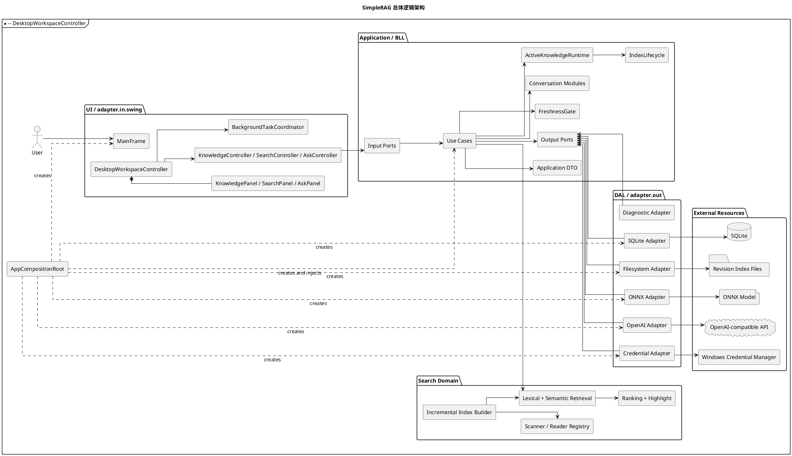

图示说明：该图从左到右展示了 SimpleRAG 的完整依赖链路。用户操作首先进入 Swing 视图和页面控制器，随后经应用输入端口到达用例；用例通过运行态、生命周期和检索领域实现业务规则，并仅通过输出端口访问 SQLite、文件系统、ONNX、远程 API 与系统凭据等资源。位于最外层的 `AppCompositionRoot` 负责创建并连接所有具体实现，因此业务层依赖的是抽象端口，而具体技术组件反向实现这些端口，体现了 Ports and Adapters 架构的依赖倒置关系。

### 3.2 分层职责

| 层次或区域 | 主要包 | 设计职责 |
| --- | --- | --- |
| UI 表示层 | `com.simplerag.adapter.in.swing` | Swing 页面、窗口组合、输入采集、页面工作流、后台任务回调、文件打开网关 |
| BLL 应用层 | `com.simplerag.application` | 输入/输出端口、用例编排、活动运行态、索引生命周期、freshness gate、会话和 DTO |
| 检索领域 | `com.simplerag.search` | 扫描、reader 注册、分块、增量规划、索引构建、特征、评分、排序和高亮 |
| DAL 基础设施层 | `com.simplerag.adapter.out` | SQLite、revision 文件、WatchService、ONNX、HTTP、凭据和诊断实现 |
| Model | `com.simplerag.model`、`application.dto` | 领域实体、状态、检索结果、引用和跨层传输视图 |
| Common | `com.simplerag.common` | 仅依赖 JDK 的摘要与文本规范化等跨层稳定能力 |
| Bootstrap | `com.simplerag.bootstrap` | 创建具体实现、管理对象生命周期并完成构造器注入 |

UI 表示层不直接访问 SQLite、ONNX、索引文件或 HTTP client。`MainFrame` 只负责窗口组合、导航和关闭，`DesktopWorkspaceController` 负责页面工作流，三个 Panel 分别拥有自己的 Swing 控件状态和渲染器，三个页面 Controller 把 UI 参数转换为 input port 调用。后台任务统一由 `BackgroundTaskCoordinator` 创建 `SwingWorker`，确保进度与完成回调在 EDT 上处理。

应用层把“管理知识库、管理数据源、重建索引、检索、问答、API 设置和桌面只读模型”拆成独立 input port。运行时部分以 `ActiveKnowledgeContext` 保存知识库、revision、状态、freshness 和 `IndexHandle` 的一致快照；用例不能绕过 `IndexLifecycle` 任意改写运行态。输出侧则按知识库、数据源、索引发布、freshness、设置、秘密、索引文件、embedding 和聊天模型拆分端口。

检索领域不依赖 Swing 或具体 adapter。`DocumentScanner` 负责文件系统遍历策略，`DocumentReaderRegistry` 负责格式选择，`ChunkerRegistry` 负责把统一文档结构分块，`IncrementalIndexPlanner` 纯比较文件身份，`IncrementalIndexBuilder` 负责复用和组装完整快照，查询侧再由 `QueryAnalyzer`、`LexicalScorer`、`SemanticScorer`、`RankingPolicy` 和 `SemanticHighlightService` 组合完成。

基础设施层实现应用所定义的端口。`AppRepository` 负责 SQLite 元数据和事务，`FileSystemIndexRepository` 负责版本化索引文件，`FileSystemSourceFreshnessMonitor` 组合递归 WatchService 与周期核对，`Langchain4jOnnxEmbeddingProvider` 负责本地模型，`OpenAiCompatibleClient` 负责 HTTP/JSON/SSE，`WindowsCredentialManagerSecretStore` 负责系统凭据并以 `SecretCodec` 作为兼容 fallback。

### 3.3 依赖方向与架构约束

系统的主依赖方向是 `Swing -> input ports -> use cases -> output ports <- adapters`。`common` 可以被多个区域依赖，但不能反向依赖 UI、应用、检索、模型或基础设施。具体 adapter 的实例化只能出现在 `AppCompositionRoot` 等 bootstrap 入口。ArchUnit 测试持续检查应用层不依赖 Swing 或 concrete adapter、Swing 不绕过用例访问 SQLite/索引/ONNX、基础设施只由 bootstrap 装配、Common 保持 JDK-only，以及 Swing 只消费 application DTO 而不接触 `DocumentChunk`、`SemanticSearchEngine` 或 `IndexHandle`。

### 3.4 活动运行态与状态机

活动运行态必须把知识库元数据、source revision、索引状态、freshness 证据和活动句柄作为一个不可分割的上下文更新。`ActiveKnowledgeRuntime` 使用单一原子入口替换上下文，`IndexLifecycle` 在转换前检查知识库 ID、revision、发布 revision 和 handle identity。跨知识库、跨 revision 或过期构建的发布请求会被拒绝，避免 UI、watcher 和构建线程在并发条件下拼出不存在的状态组合。

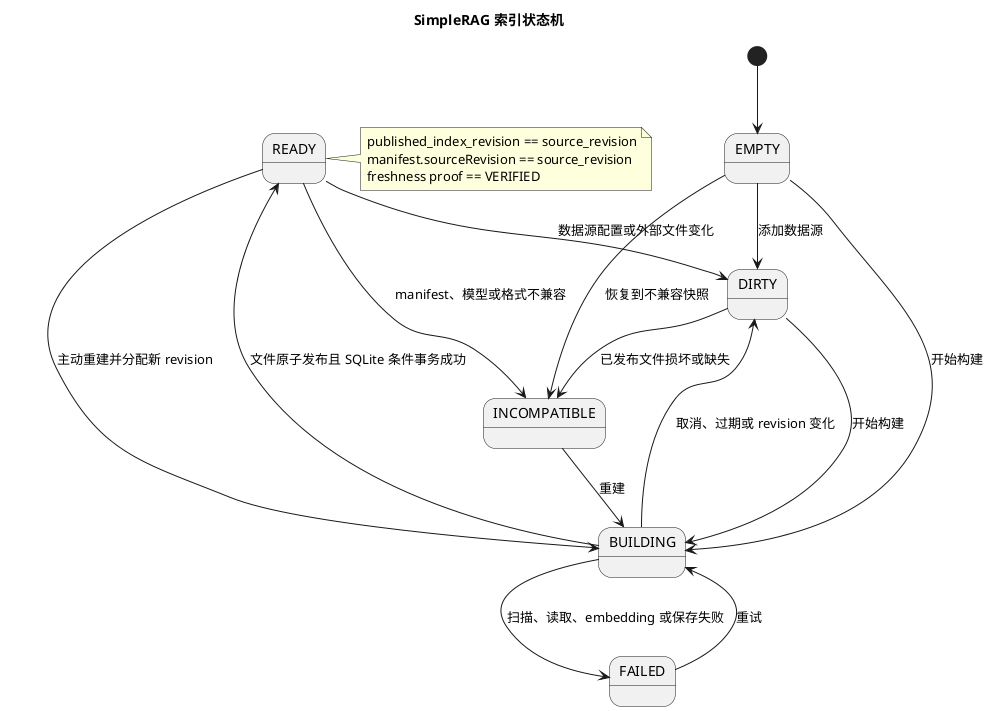

图示说明：该状态图描述索引从未构建、数据变化、构建中、可用、失败和不兼容等状态之间的合法迁移。只有索引文件完成原子发布、SQLite 条件事务提交并满足 revision 与 freshness 一致性时，`BUILDING` 才能进入 `READY`；构建取消或身份过期会回到 `DIRTY`，扫描、读取、向量化或保存异常则进入 `FAILED`。图中的 `READY` 注释给出了远程 RAG 可用的核心条件，即发布 revision、source revision、manifest 和 freshness proof 必须一致，任何不确定状态都按保守策略拒绝继续使用。

### 3.5 索引构建与发布架构

构建开始时，应用从 Repository 捕获不可变 `IndexBuildRequest`，其中包括知识库 ID、source revision、数据源列表、source set hash 和模型签名。构建器读取上一已发布快照，扫描当前文件并计算 `FileFingerprint`，再由纯计算的 `IncrementalIndexPlanner` 输出 added、modified、deleted 和 reused 集合。未变化文件复用原 chunks 与 embeddings，新增或修改文件经过 reader、chunker 和批量 embedding，删除文件不进入新结果，最终生成当前全部文件的 v5 完整快照。

发布前再次计算 source set hash，用于拒绝构建期间发生的文件变化。快照先写临时文件并原子移动到 revision 文件，之后 SQLite 在同一事务内 upsert `knowledge_index` 并以 `knowledge_base.id + source_revision + BUILDING` 为条件更新发布指针。条件不满足时事务回滚且新文件被清理；只有事务成功后活动 `IndexHandle` 才切换。该顺序保证数据库不会指向半成品，内存也不会先于持久化状态看到新索引。

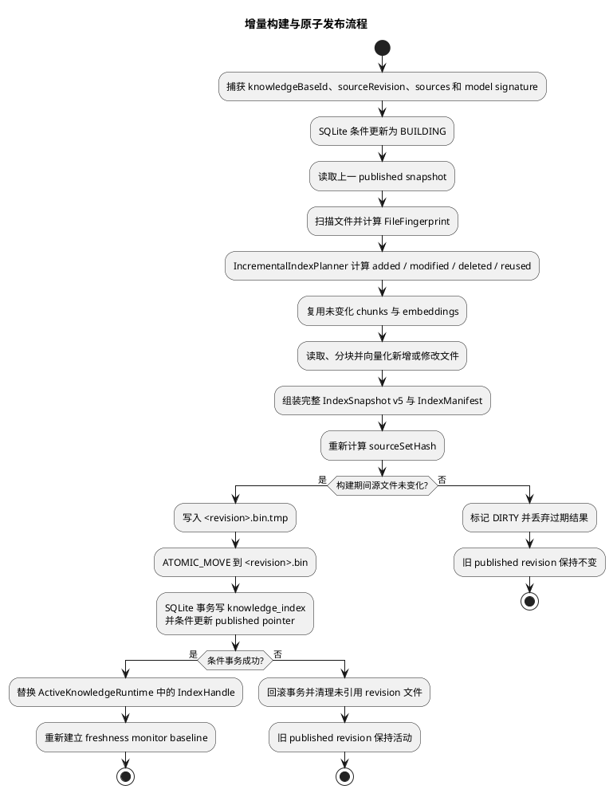

图示说明：该活动图按照实际执行顺序展示了增量索引的计算与发布过程。系统先固定本次构建的知识库身份和 revision，再比较文件指纹以复用未变化内容，并把新增、修改和保留的数据重新组装为完整快照；发布阶段严格执行“写临时文件、原子移动、提交数据库条件事务、替换内存句柄”的顺序。两个判断分支分别防止构建期间源文件变化和陈旧任务覆盖新状态，任何条件失败都会保留旧的 published revision，并清理未被引用的新文件。

### 3.6 检索与 RAG 调用架构

检索请求由 `SearchUseCase` 使用任务携带的 `knowledgeBaseId + sourceRevision` 获取当前 `IndexHandle`。查询经过意图识别和主题清理，词法侧综合 TF-IDF、路径、文件名、扩展名和代码声明特征，语义侧在模型签名与向量维度兼容时计算相似度，再由 `RankingPolicy` 混合评分。语义不可用或维度不一致时系统显式降级到词法模式，不会把不兼容向量当成有效结果。

RAG 问答在每一轮都重新检索，不沿用上一轮 citations。`AskUseCase` 先检查 identity、`READY`、发布 revision 和 freshness，再检查每知识库 local-only 策略，生成当前轮引用并让 UI 展示，随后再次通过 freshness gate，构造只含目标主机、revision 和引用摘要的 `RemoteSendReview`，经用户授权后才创建 `ChatRequest`。对话历史只保存 user/assistant 文本，不含 system 消息或上一轮引用正文；失败或取消的轮次不会进入会话历史。

### 3.7 部署与物理存储架构

系统打包为一个可执行 JAR，在单个 JVM 中运行 Swing、业务用例、ONNX 推理和后台任务。SQLite 数据库默认位于 `%USERPROFILE%\.simplerag\simplerag.db`，revision 索引位于 `%USERPROFILE%\.simplerag\indexes\<knowledgeBaseId>\<revision>.bin`，模型位于项目的 `models\multilingual-minilm`，模型签名缓存位于 `%USERPROFILE%\.simplerag\cache\model-signatures.json`。Windows 环境中的 API Key 首选进入当前用户的 Credential Manager；SQLite 对新凭据只保存 marker。会话和诊断 ring buffer 保存在进程内，应用退出后不恢复。

## 4. 设计模式类图

本节按项目架构文档中已经确认的模式分别给出标准 PlantUML 类图。MVC 属于表示层架构模式，Registry、Repository、Composition Root 与 Dependency Injection 属于企业应用或架构模式，其余模式对应典型对象协作模式。每幅图都可以单独复制到 PlantUML 渲染器中生成图片。
### 4.1 MVC 模式

在语义检索页面中，`SearchPanel` 是 View，负责查询输入、扩展名筛选、结果列表和预览状态；`DesktopWorkspaceController` 与 `SearchController` 承担 Controller 职责，负责接收界面回调、创建后台任务、检查 identity 并调用输入端口；`SearchUseCase` 和 `SearchKnowledge` 构成应用 Model 边界，`SearchResultView` 是返回给 UI 的视图模型。Panel 不直接持有 `SemanticSearchEngine` 或 `IndexHandle`，应用模型也不依赖 Swing 类型。

```plantuml
@startuml
skinparam classAttributeIconSize 0
skinparam shadowing false
skinparam linetype ortho
skinparam packageStyle rectangle
skinparam class {
  BackgroundColor #F8FAFC
  BorderColor #334155
  ArrowColor #475569
}
skinparam interface {
  BackgroundColor #EFF6FF
  BorderColor #2563EB
}
title SimpleRAG - MVC 模式（语义检索页面）
left to right direction

package "View" {
  class SearchPanel <<View>> {
    -results : DefaultListModel<SearchResultView>
    -query : JTextField
    -resultList : JList<SearchResultView>
    +query() : String
    +extension() : String
    +selected() : SearchResultView
    +searching() : void
    +results(values : List<SearchResultView>) : void
    +preview(result : SearchResultView) : void
    +searchFailed() : void
  }
}

package "Controller" {
  class DesktopWorkspaceController <<Controller>> {
    -searchPanel : SearchPanel
    -search : SearchController
    -performSearch() : void
    -setPreview(result : SearchResultView) : void
    -locateSemanticMatches(result : SearchResultView) : void
  }

  class SearchController <<Presentation Controller>> {
    -search : SearchKnowledge
    +search(identity, query, limit, extension) : List<SearchResultView>
    +highlights(identity, query, document, limit) : List<SemanticHighlight>
  }
}

package "Model / Application" {
  interface SearchKnowledge <<Input Port>> {
    +search(knowledgeBaseId, expectedRevision, query, limit, extension) : List<SearchResultView>
    +semanticHighlights(knowledgeBaseId, expectedRevision, query, document, limit) : List<SemanticHighlight>
  }

  class SearchUseCase <<Model>> {
    -runtime : ActiveKnowledgeRuntime
    +search(...) : List<SearchResultView>
    +semanticHighlights(...) : List<SemanticHighlight>
  }

  class SearchResultView <<DTO>> {
    +document : DocumentReference
    +score : double
    +reason : String
  }
}

DesktopWorkspaceController *-- SearchPanel : owns and updates
SearchPanel ..> DesktopWorkspaceController : UI callbacks
DesktopWorkspaceController *-- SearchController
SearchController --> SearchKnowledge : invokes
SearchUseCase ..|> SearchKnowledge
SearchUseCase ..> SearchResultView : creates
SearchPanel "1" o-- "0..*" SearchResultView : renders
DesktopWorkspaceController ..> SearchResultView : coordinates

legend bottom
  <|..  interface realization
  *--   composition
  o--   aggregation
  ..>   dependency / callback
endlegend
@enduml
```

图示说明：该类图将检索页面划分为 View、Controller 和 Model 三类角色。`SearchPanel` 只负责界面输入与结果展示，并把用户事件交给 `DesktopWorkspaceController`；工作区控制器通过 `BackgroundTaskCoordinator` 组织异步任务，再由 `SearchController` 调用 `SearchKnowledge` 输入端口，最终由 `SearchUseCase` 返回 `SearchResultView`。依赖箭头表明 Swing 视图不会直接接触索引内部对象，业务结果通过 application DTO 返回，从而形成可测试且线程边界清晰的表示层协作。

采用 MVC 的原因是检索页面同时存在界面状态、事件编排、异步调度和检索业务四种变化因素，如果全部写入一个 Swing Panel，视图会直接依赖索引运行时，既难以测试也容易违反 EDT 规则。拆分后可以单独构造和测试 Panel，可以替换 UseCase 或使用 fake input port 验证 Controller，也可以在不修改检索算法的情况下调整界面布局。该模式还配合 application DTO 建立清晰的 UI 边界，防止领域内部对象泄漏到表示层。

### 4.2 Adapter 模式

`ChatModel` 是应用层需要的目标接口，`AskUseCase` 只认识列出模型、生成回答和流式回答等业务能力。`OpenAiCompatibleClient` 是具体 Adapter，它把 `ApiConfig` 与 `ChatRequest` 转换为 OpenAI 兼容 HTTP 请求，通过 `HttpClient` 发送 JSON 或读取 SSE，再把远程响应转换为 `RagAnswer`。同样的结构也体现在 `TextEmbedder` 与 ONNX adapter、`SecretStore` 与 Credential Manager adapter、Repository Port 与 SQLite adapter 之间。

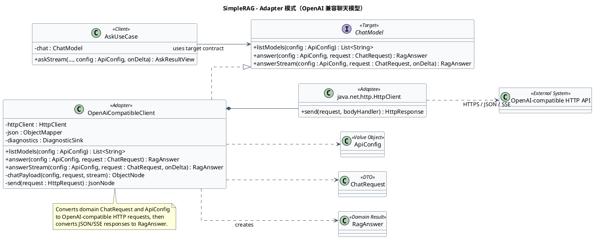

图示说明：该类图以远程聊天能力为主线说明 Adapter 的结构。应用层的 `AskUseCase` 依赖目标接口 `ChatModel`，`OpenAiCompatibleClient` 实现该接口，并在内部把领域请求转换成 `HttpClient` 能够发送的 HTTP、JSON 和 SSE 协议；同一图中的 embedding、凭据和持久化端口展示了相同的适配关系。这样，左侧用例只认识稳定的业务能力，右侧外部 SDK、操作系统 API 和数据格式的变化由各自 Adapter 吸收。

采用 Adapter 的原因是 HTTP 路径、鉴权头、JSON 结构、SSE 增量解析、ONNX Runtime、JDBC 和系统凭据 API 都属于易变化的技术细节，不应该进入应用用例。通过稳定端口包装外部能力，远程协议变化被限制在 `adapter.out.openai`，模型实现变化被限制在 `adapter.out.onnx`，操作系统差异被限制在 `adapter.out.security`。应用层因此可以用 fake adapter 进行确定性测试，也可以在不改变业务规则的前提下替换外部服务或存储技术。

### 4.3 Repository 模式

应用层分别定义 `KnowledgeBaseRepository`、`KnowledgeSourceRepository`、`IndexPublicationRepository`、`FreshnessRepository` 与 `SettingsRepository`，表达不同用例需要的数据访问能力。`AppRepository` 聚合实现这些端口，把领域实体和 manifest 映射到 SQLite 表，并通过 `DatabaseManager` 与 `SqliteTransactionManager` 管理连接和跨表事务。应用服务只调用 Repository 方法，不拼接 SQL，也不处理 JDBC 资源和 SQLite 异常。

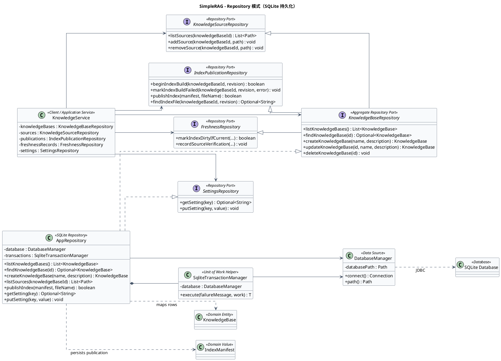

图示说明：该类图展示应用层以多个细粒度 Repository Port 表达知识库、数据源、索引发布、freshness 和设置访问需求，而 `AppRepository` 统一实现这些接口。用例面向端口读写领域对象，不直接处理 SQL、JDBC 连接和行映射；`AppRepository` 再委托 `DatabaseManager` 获取连接，并使用 `SqliteTransactionManager` 保证涉及多表或发布指针的操作处于同一事务。该结构同时保留了接口隔离和统一事务实现，使测试可替换端口，生产环境又能维持跨表一致性。

采用 Repository 的原因是知识库管理、数据源变更、索引发布和 freshness 更新都需要持久化，但业务规则不应与表结构或 JDBC 生命周期绑定。Repository 为领域对象提供集合式访问边界，使上层可以围绕知识库、发布和设置编写用例，同时让数据访问层集中处理参数化 SQL、行映射、异常转换和事务。细粒度端口落实接口隔离，生产环境由同一 `AppRepository` 聚合实现又能保证跨表原子性，两者并不冲突。

### 4.4 Strategy 模式

`DocumentReader` 定义统一的文档读取策略，具体实现分别处理纯文本、PDF、DOCX、PPTX、XLSX 和 HTML。所有策略返回统一的 `ReadDocument`，其中包含路径、根目录、文档 ID、扩展名、逻辑 sections、reader 身份、版本和警告。调用方只使用策略接口，格式特有的 PDF 页数限制、OOXML 解压保护、XLSX SAX 读取或 HTML 正文提取都封装在具体 reader 中。

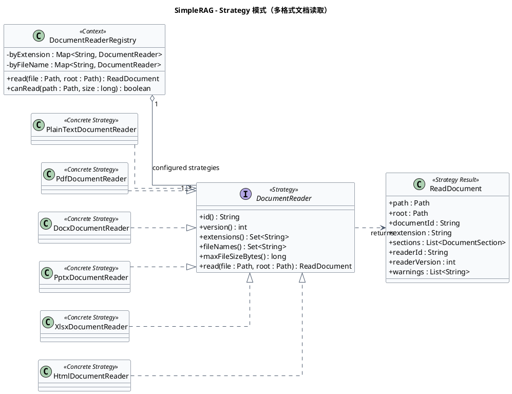

图示说明：该类图把 `DocumentReader` 定义为稳定策略接口，并为文本、PDF、DOCX、PPTX、XLSX 和 HTML 提供独立的具体策略。扫描和索引流程只接收统一的 `ReadDocument`，由上下文在运行时选择合适 reader，因此各格式特有的解析库、安全限制、来源定位和版本信息均封装在具体实现中。新增格式时只需增加新的策略实现并完成注册，无须修改既有扫描、分块和索引主流程。

采用 Strategy 的原因是不同文档格式的解析库、安全限制和来源定位规则变化频率不同，而扫描、分块、索引和排序流程需要稳定的统一输入。如果在扫描器中使用大段扩展名分支，每增加一种格式都要修改中心流程并提高回归风险。策略接口让新格式通过新增实现扩展，使每种 reader 可以独立测试和版本化，并让后续流程保持对格式无感，从而体现开闭原则和组合优于继承。

### 4.5 Registry 模式

`DocumentReaderRegistry` 在构造时接收 reader 集合，把策略分别按规范化扩展名和精确文件名注册到映射中。查询时精确文件名优先于扩展名，因此 `Dockerfile`、`Makefile`、`README` 等无扩展名文件也能被识别；注册冲突会在启动阶段立即抛出异常。`DocumentScanner` 通过 `descriptor` 获取 reader 身份、版本和大小限制，`IncrementalIndexBuilder` 通过 `read` 获取统一文档，不需要知道具体 reader 类。

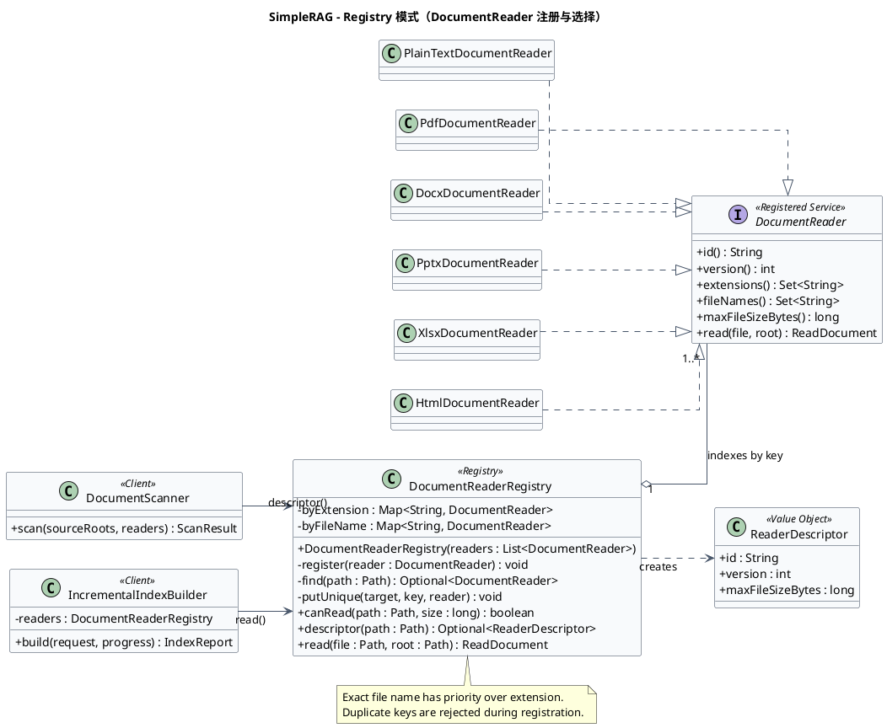

图示说明：该类图展示 `DocumentReaderRegistry` 如何集中管理 reader 的注册与选择。每个 `DocumentReader` 通过 `DocumentReaderDescriptor` 声明扩展名、精确文件名、版本和大小限制，Registry 将这些描述映射到内部查找表，并向 `DocumentScanner` 与 `IncrementalIndexBuilder` 提供一致的 `descriptor` 和 `read` 入口。精确文件名优先、扩展名规范化和冲突快速失败都由 Registry 统一执行，避免不同调用方维护不一致的格式判断分支。

采用 Registry 的原因是格式策略不仅需要多态执行，还需要一个集中、确定且可验证的选择机制。如果扫描、读取和增量规划各自维护扩展名条件，它们会产生不一致的支持范围和版本判断。Registry 把名称规范化、优先级、冲突检查、大小限制与策略定位集中在单一对象中，使新增 reader 的影响被限制在注册配置，调用方只依赖查找协议，并能以自定义 reader 列表进行小范围测试。

### 4.6 Facade 模式

`KnowledgeService` 作为应用层门面，实现知识库管理、数据源管理、索引重建、检索、问答、API 设置与桌面只读模型等多个输入端口，并在内部协调 Repository、索引文件、embedding、聊天模型、freshness monitor、`FreshnessGate` 和 `ActiveKnowledgeRuntime`。当前结构进一步使用 `KnowledgeBaseUseCases`、`KnowledgeSourceUseCases`、`IndexBuildUseCase` 与 `DesktopQueryService` 暴露更小的用例对象，这些对象可以通过对应端口委托给门面。

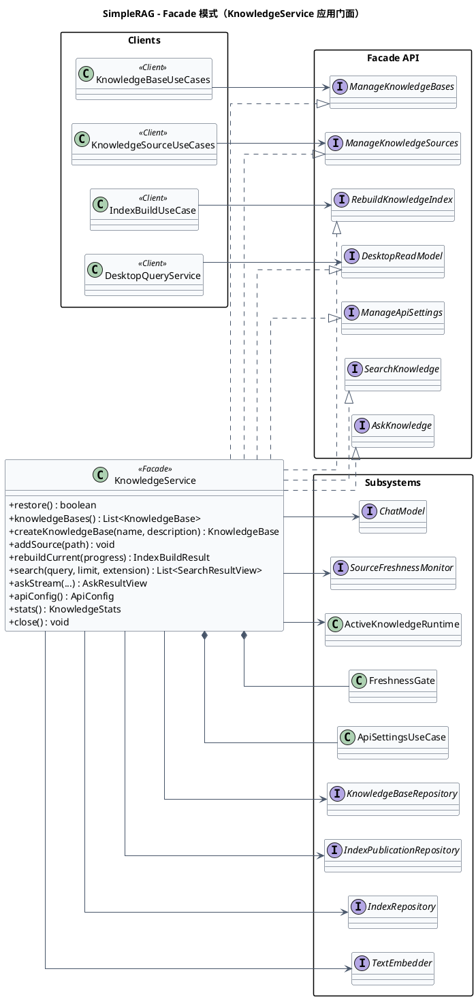

图示说明：该类图把 `KnowledgeService` 放在多个输入端口与复杂子系统之间，说明其 Facade 角色。UI 或较小的用例对象只调用面向业务场景的接口，门面内部再协调 Repository、索引存储、embedding、聊天模型、freshness monitor、生命周期和活动运行态完成跨组件流程。图中的依赖关系强调调用者无需了解这些子系统的连接顺序和一致性规则，同时拆分后的输入端口又使不同客户端只依赖自己实际使用的能力。

采用 Facade 的原因是一次桌面操作可能跨越数据库、磁盘索引、模型、运行态和 freshness 子系统，若由 Swing 直接协调，会造成高耦合并复制状态检查。门面提供稳定且面向用例的入口，把恢复知识库、捕获构建身份、条件发布、状态迁移、资源关闭等复杂流程封装在应用层。调用者因此不需要理解子系统连接方式，同时较小 input port 又避免所有客户端被迫依赖整个门面接口。

### 4.7 Command 模式

`BackgroundCommand<R, P>` 是函数式命令接口，把耗时操作表示为可执行对象，并允许执行过程中发布进度。`DesktopWorkspaceController` 使用 lambda 创建搜索、高亮、索引或问答命令，`BackgroundTaskCoordinator` 作为统一执行器，通过 `SwingWorker` 执行命令并处理进度、成功、失败、取消和过期结果，返回的 `TaskHandle` 为调用方提供取消与完成状态。具体 receiver 可以是 `SearchController`、`KnowledgeController` 或 `AskController`。

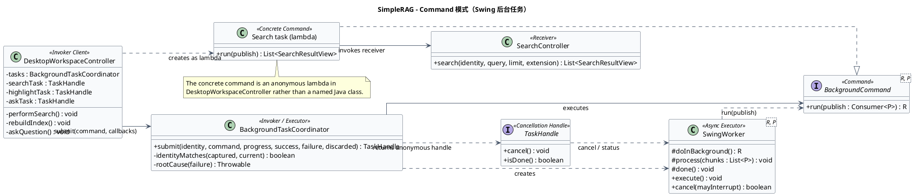

图示说明：该类图将耗时桌面操作抽象为泛型 `BackgroundCommand<R, P>`，命令封装实际工作并通过进度回调上报状态。`BackgroundTaskCoordinator` 作为 Invoker 统一在 `SwingWorker` 中执行命令，处理成功、失败、取消、EDT 回调和过期结果，并以 `TaskHandle` 暴露任务控制；页面控制器或用例对象则充当具体 Receiver。搜索、索引和问答可以使用 lambda 形成不同具体命令，但共享完全相同的异步执行框架。

采用 Command 的原因是 Swing 后台操作虽然业务内容不同，却共享相同的异步生命周期和线程约束。把操作封装为命令后，执行器可以统一完成异常解包、EDT 回调、identity 复查和取消处理，而不必在每个页面复制 `SwingWorker` 子类。使用 lambda 作为匿名具体命令既保留了行为参数化和调用方解耦，又避免为每个短任务创建样板类，是 Java 函数式接口与经典 Command 模式的结合。

### 4.8 Composition Root / Dependency Injection 模式

`App.main` 只创建 `AppCompositionRoot` 并调用 `start`。组合根创建数据库、Repository、ONNX provider、诊断日志、凭据存储、OpenAI client、freshness monitor、活动运行态和文件索引 adapter，再通过构造器把这些实例注入 `KnowledgeService`、独立 UseCase、页面 Controller 和 `MainFrame`。系统不引入 Spring 或 DI 容器，对象图和生命周期在普通 Java 代码中显式可见。

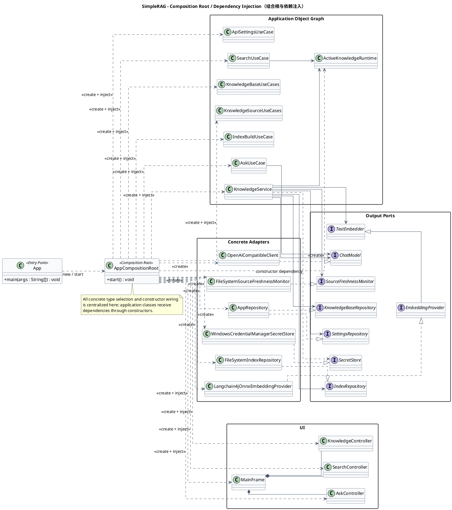

图示说明：该类图展示应用启动时对象图的集中装配过程。`AppCompositionRoot` 创建 SQLite Repository、文件索引、ONNX provider、OpenAI client、凭据存储、freshness monitor 与唯一的 `ActiveKnowledgeRuntime`，随后通过构造器把这些依赖注入 Service、UseCase、Controller 和 `MainFrame`。所有具体类型选择均被限制在组合根中，其余类只声明接口依赖，因此共享对象的生命周期清晰，测试也能直接替换为 fake 或内存实现。

采用 Composition Root 与 Dependency Injection 的原因是系统包含多种外部资源和共享运行态，如果业务对象自行 `new` 具体实现，技术选择会扩散到整个代码库，共享实例也可能被意外重复创建。集中装配使唯一 `ActiveKnowledgeRuntime`、freshness monitor 和诊断日志得到明确共享，使 adapter 的创建位置可以被架构测试约束，并让单元测试直接向构造器传入 fake。显式手工注入适合当前单体规模，避免额外框架成本，同时保留未来替换实现的能力。

## 5. 体现的面向对象设计原则

### 5.1 单一职责原则（SRP）

系统把不同变化原因分配给不同类。Panel 只管理视图状态，Controller 只处理页面工作流和参数转换，UseCase 负责业务用例，Repository 负责持久化，Reader 负责一种格式的文本抽取，`BackgroundTaskCoordinator` 负责异步任务生命周期，`IndexLifecycle` 负责运行态转换。以检索为例，扫描、读取、分块、特征、评分、排名和高亮各有独立对象，避免 `SemanticSearchEngine` 演变成同时处理文件系统、模型、UI 和数据库的万能类。

### 5.2 开闭原则（OCP）

系统在真正需要扩展的边界定义接口和注册机制。新增文档格式时实现 `DocumentReader` 并注册即可，不修改扫描器、分块器或排序器；替换聊天服务时实现 `ChatModel`，替换 embedding 时实现 `TextEmbedder`，替换索引持久化时实现 `IndexRepository`。查询分析和排名也被拆成独立组合对象，使策略调整不要求修改快照发布协议。系统对新实现开放，对已有稳定调用方的修改保持克制。

### 5.3 里氏替换原则（LSP）

每个端口的具体实现必须遵守接口语义，而不仅是具有相同方法签名。任意 `DocumentReader` 都应返回可定位、不可变且带 reader 版本的 `ReadDocument`，任意 `ChatModel` 都应把请求转换为 `RagAnswer` 并通过声明的异常报告传输失败，任意 `IndexRepository` 都不能在保存失败时暴露半成品快照。测试中的 fake 可以替代生产 adapter，说明用例依赖的是行为契约而非具体类型。对于不兼容模型或旧快照，系统采用显式降级和状态转换，而不是让某个实现偷偷破坏上层预期。

### 5.4 接口隔离原则（ISP）

输出端口没有被设计成一个包含全部数据访问能力的巨大接口，而是拆分为 `KnowledgeSourceRepository`、`IndexPublicationRepository`、`FreshnessRepository`、`SettingsRepository`、`SecretStore`、`IndexRepository` 等。输入端口同样按管理知识库、管理数据源、重建、检索、问答和设置拆分。客户端只依赖它实际需要的方法，生产中的 `AppRepository` 虽然聚合实现多个端口，但这种实现复用不会迫使每个用例依赖全部能力。

### 5.5 依赖倒置原则（DIP）

高层用例依赖 `ChatModel`、`TextEmbedder`、Repository Port、`SecretStore` 和 `SourceFreshnessMonitor` 等抽象，具体 SQLite、ONNX、HTTP、文件系统和 Windows API 实现反过来实现这些抽象。依赖由 `AppCompositionRoot` 从外向内注入，应用层不负责选择 concrete class。该原则使业务规则稳定地处于依赖图中心，并直接支持 fake 测试、技术替换和架构边界验证。

### 5.6 封装与信息隐藏

系统把易出错的不变量放在拥有数据的对象附近。`ActiveKnowledgeContext` 与 `IndexLifecycle` 隐藏合法状态转换条件，`DocumentReaderRegistry` 隐藏 reader 查找优先级和冲突检测，`ApiConfig` 隐藏 URL 与 host 校验，`ChatRequest` 隐藏历史消息约束，`SqliteTransactionManager` 隐藏提交与回滚模板，`WindowsCredentialManagerSecretStore` 隐藏本地系统 API 与 fallback。调用者通过稳定方法完成意图，不需要复制内部规则。

### 5.7 组合优于继承

检索流水线采用对象组合而不是建立庞大的抽象搜索引擎继承树。`SemanticSearchEngine` 组合 scanner、registry、chunker、feature extractor、query analyzer、scorer、ranking policy 和 highlight service；应用服务组合多个 output port；窗口组合 Controller 与 Panel。继承主要用于接口实现和 Swing 框架要求，业务变化通过替换协作对象表达，降低基类变化对整个系统的影响。

### 5.8 高内聚、低耦合与最少知识

每个 package 围绕一个内聚主题组织，UI 不需要知道 SQL 表和 ONNX 文件，Repository 不需要知道 Swing 控件，Reader 不需要知道排名策略，远程 adapter 不需要知道窗口布局。Controller 通过 input port 与 DTO 交流，UseCase 通过 output port 与 adapter 交流，避免跨越多个对象层级读取内部字段。`ArchitectureTest` 把这种低耦合要求转化为构建门禁，而不是仅依赖开发者自觉。

### 5.9 不可变值对象与显式身份

`IndexBuildRequest`、`IndexManifest`、`IndexIdentity`、`EmbeddingModelSignature`、`FreshnessSnapshot`、`ChatRequest` 和 application DTO 大量使用 Java record。不可变对象可以安全地跨线程传递，也便于比较、序列化和测试。尤其是知识库 ID 与 revision 被作为显式身份随任务和快照传播，后台线程不能通过读取可变全局变量猜测自己仍然有效，从而减少时间竞争和陈旧结果覆盖问题。

### 5.10 防御式设计与快速失败

系统对 reader 注册冲突、空知识库名称、非法 API URL、system 历史消息、跨 revision 发布、损坏快照和向量维度不一致执行早期检查。条件不满足时返回明确错误、进入 `DIRTY`/`FAILED`/`INCOMPATIBLE` 或降级到词法模式，而不是继续执行并产生难以解释的数据。远程 RAG 对不确定 freshness 采用 fail-closed，索引发布对不支持原子移动采用失败而不是非原子覆盖，这体现了把数据正确性置于表面可用性之上的原则。

## 6. 数据库设计

### 6.1 数据持久化边界

SimpleRAG 使用 SQLite 保存关系型元数据，包括知识库、数据源路径、索引发布 manifest、freshness 记录和应用设置。向量、chunks、文件级 fingerprints 与索引状态体量较大且按 revision 整体发布，因此不存入 SQLite BLOB，而是保存在版本化 `IndexSnapshot` 二进制文件中；数据库只保存文件名、manifest 和当前发布指针。API Key 新值不直接保存在数据库中，Windows 上由 Credential Manager 保存，`app_setting` 只记录 `wincred:v1:SimpleRAG/API` marker。多轮会话和诊断事件当前保存在内存中，不属于数据库 schema。

数据库默认路径为 `%USERPROFILE%\.simplerag\simplerag.db`。`DatabaseManager` 每次建立连接都执行 `PRAGMA foreign_keys = ON` 和 `PRAGMA busy_timeout = 5000`，前者启用级联外键约束，后者为桌面后台线程之间的短时写锁竞争提供五秒等待窗口。数据库时间字段统一以 `INTEGER` 保存 Java epoch milliseconds，状态枚举以 `TEXT` 保存，应用读取时转换为 `IndexStatus`。

### 6.2 数据库概念结构与 ER 图

数据库围绕 `knowledge_base` 聚合设计。一个知识库可以配置多个 `knowledge_source`，也可以产生多个不可变 revision 的 `knowledge_index` 发布记录；删除知识库时，两个子表通过 `ON DELETE CASCADE` 自动清理。`published_index_revision` 与 `knowledge_index.revision` 构成逻辑发布引用，但数据库没有声明复合外键，发布一致性由同一事务中的条件更新保证。`app_setting` 是独立键值表，`schema_version` 保存 migration 版本。

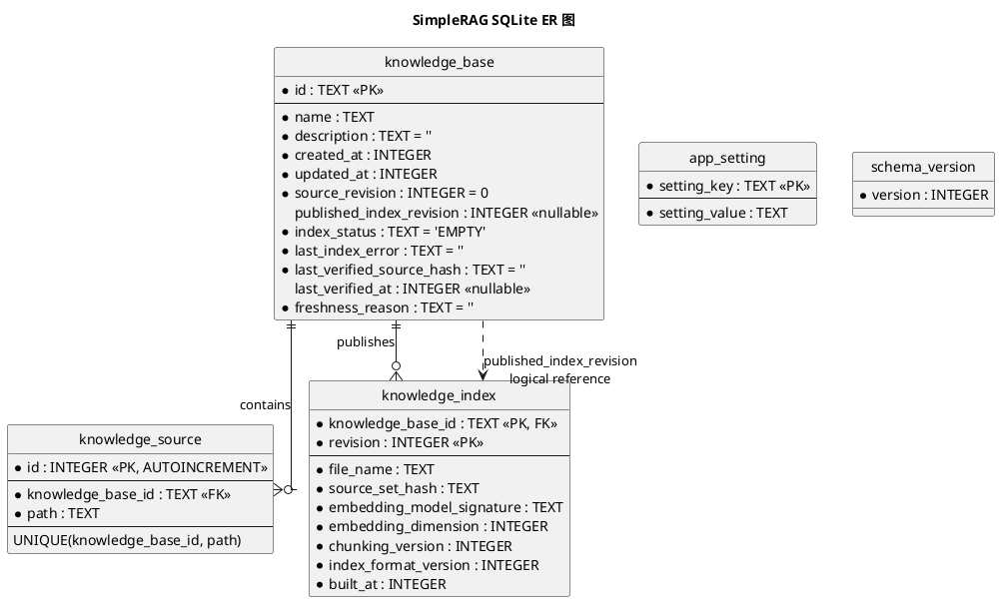

图示说明：该 ER 图以 `knowledge_base` 为聚合根，一个知识库可拥有零到多个 `knowledge_source` 和零到多个不可变的 `knowledge_index` revision，删除聚合根时两个子表通过外键级联清理。`published_index_revision` 以逻辑引用指向当前成功发布的索引记录，实际一致性由发布事务和条件更新保证；`app_setting` 与 `schema_version` 独立保存应用配置和数据库迁移版本。该模型让可变的知识库状态、来源配置与不可变的索引历史相互分离，同时避免把大体量 chunks 和向量直接存入 SQLite。

### 6.3 `knowledge_base` 表设计

`knowledge_base` 是系统的聚合根和索引状态权威来源。它不仅保存名称与描述，还保存数据源 revision、当前发布 revision、索引状态、最近错误和 freshness 证据。`source_revision` 每次在有效数据源变化或 watcher 确认外部变化时递增；`published_index_revision` 只有在文件发布与数据库条件事务全部成功时更新，因此它可以继续指向旧的可用快照。`READY` 并不只表示一个字符串状态，还要求发布 revision、source revision、manifest 与 freshness proof 一致。

| 字段 | SQLite 类型 | 空值/默认 | 约束与用途 |
| --- | --- | --- | --- |
| `id` | `TEXT` | 非空 | 主键，应用使用 UUID 字符串 |
| `name` | `TEXT` | 非空 | 知识库名称，应用限制非空且不超过 60 个字符 |
| `description` | `TEXT` | 非空，默认 `''` | 知识库说明 |
| `created_at` | `INTEGER` | 非空 | 创建时间，epoch milliseconds |
| `updated_at` | `INTEGER` | 非空 | 最近元数据、状态或发布更新时间 |
| `source_revision` | `INTEGER` | 非空，默认 `0` | 数据源逻辑版本和任务身份的一部分 |
| `published_index_revision` | `INTEGER` | 可空 | 当前已成功发布的索引 revision；空表示从未发布 |
| `index_status` | `TEXT` | 非空，默认 `EMPTY` | `EMPTY`、`READY`、`DIRTY`、`BUILDING`、`FAILED`、`INCOMPATIBLE` |
| `last_index_error` | `TEXT` | 非空，默认 `''` | 最近构建、失效或兼容性错误摘要 |
| `last_verified_source_hash` | `TEXT` | 非空，默认 `''` | 最近完整核对得到的数据源集合 hash |
| `last_verified_at` | `INTEGER` | 可空 | 最近完整核对时间 |
| `freshness_reason` | `TEXT` | 非空，默认 `''` | 当前 freshness 变化或拒绝原因 |

`IndexStatus.EMPTY` 表示尚无可用索引，`READY` 表示当前 source revision 已成功发布并可以在 freshness 通过后使用，`DIRTY` 表示源配置或文件内容发生变化，`BUILDING` 表示新 revision 正在构建，`FAILED` 表示当前构建失败但旧发布指针可以保留，`INCOMPATIBLE` 表示磁盘文件、manifest、模型或格式无法安全恢复。状态转换由 Repository 条件 SQL和 `IndexLifecycle` 双重约束。

### 6.4 `knowledge_source` 表设计

`knowledge_source` 保存用户为知识库配置的本地根目录。路径写入前转换为绝对、规范化字符串，联合唯一约束防止同一知识库重复添加同一路径，外键保证数据源一定属于存在的知识库。`INSERT OR IGNORE` 和带路径条件的 `DELETE` 使重复添加或删除不存在路径成为幂等操作，只有实际影响一行时才在同一事务中递增 `source_revision` 并标记 `DIRTY`。

| 字段 | SQLite 类型 | 空值/默认 | 约束与用途 |
| --- | --- | --- | --- |
| `id` | `INTEGER` | 非空 | 自增主键，用于保持录入顺序 |
| `knowledge_base_id` | `TEXT` | 非空 | 外键引用 `knowledge_base.id`，删除知识库时级联删除 |
| `path` | `TEXT` | 非空 | 规范化的绝对目录路径 |
| 联合约束 | — | — | `UNIQUE(knowledge_base_id, path)` 防止重复数据源 |

### 6.5 `knowledge_index` 表设计

`knowledge_index` 为每个成功准备发布的 revision 保存 `IndexManifest` 元数据和实际文件名。联合主键 `(knowledge_base_id, revision)` 保证一个知识库的一个 revision 只有一条记录；同一 revision 的幂等重试使用 upsert 更新 manifest。该表不保存 chunks 或向量，其记录必须与 `%USERPROFILE%\.simplerag\indexes\<knowledgeBaseId>\<revision>.bin` 中的完整快照配对。

| 字段 | SQLite 类型 | 空值/默认 | 约束与用途 |
| --- | --- | --- | --- |
| `knowledge_base_id` | `TEXT` | 非空 | 联合主键、外键，引用 `knowledge_base.id` |
| `revision` | `INTEGER` | 非空 | 联合主键，索引快照 revision |
| `file_name` | `TEXT` | 非空 | 对应 revision 快照文件名 |
| `source_set_hash` | `TEXT` | 非空 | 构建时规范化源集合的身份摘要 |
| `embedding_model_signature` | `TEXT` | 非空 | provider、模型文件和预处理版本的兼容签名 |
| `embedding_dimension` | `INTEGER` | 非空 | 向量维度，用于恢复与查询兼容检查 |
| `chunking_version` | `INTEGER` | 非空 | 分块规则版本，变化时触发必要重建 |
| `index_format_version` | `INTEGER` | 非空 | 二进制快照格式版本，当前源码 `IndexSnapshot.CURRENT_VERSION` 为 `5` |
| `built_at` | `INTEGER` | 非空 | 快照构建完成时间 |

二进制 `IndexSnapshot` v5 还包含 roots、全部 `DocumentChunk`、`IndexManifest` 与文件级 `DocumentIndexEntry`。每个文件 entry 保存 root、relative path、size、modified time、SHA-256 内容 hash、reader version、chunking version 和 chunk IDs，使增量 planner 能够判断复用范围。数据库只保留全局 manifest，文件级明细跟随完整快照原子发布。

### 6.6 `app_setting` 表设计

`app_setting` 是简单的持久化键值表，使用 `INSERT ... ON CONFLICT DO UPDATE` 完成 upsert。它适合体量小、结构稳定性要求较低的桌面配置，不承载知识库实体、对话历史或诊断事件。设置值虽然统一为 TEXT，但安全敏感值必须先经过 `SecretStore`，不能因为该表可写就直接保存明文秘密。

| `setting_key` 示例 | 值的含义 |
| --- | --- |
| `active_knowledge_base` | 最近选择的知识库 ID |
| `api.base_url` | OpenAI 兼容服务基础 URL |
| `api.model` | 当前模型名称 |
| `api.encrypted_key` | Windows Credential marker，或兼容场景下的 AES-GCM ciphertext |
| `api.trusted_hosts` | 逗号分隔的规范化主机集合 |
| `rag.local_only.<knowledgeBaseId>` | 每知识库是否禁止远程 RAG |

### 6.7 `schema_version` 与 migration 设计

`schema_version` 当前值为 3。版本 1 建立 `knowledge_base`、`knowledge_source`、`app_setting` 和版本表；版本 2 为知识库增加 revision、发布指针、状态和错误字段，并创建 `knowledge_index`；版本 3 增加最后核对 hash、核对时间和 freshness 原因。`DatabaseManager.initialize` 在事务中按版本顺序执行 DDL 与版本更新，任一步失败都会回滚并转换为 `DataAccessException`，避免数据库停留在应用无法识别的半迁移状态。

当前实现假设 `schema_version` 只有一行并读取其中的版本值。未来 schema 变更应继续追加单向 migration，不应修改已经发布版本的含义；涉及大表重建时应在同一迁移事务中创建新表、复制数据、校验并替换。索引二进制格式版本与 SQLite schema 版本独立管理，前者由 manifest 和 `IndexSnapshot.CURRENT_VERSION` 判断，不能用数据库 migration 版本代替。

### 6.8 事务与并发一致性设计

数据源添加或删除使用 `SqliteTransactionManager`，数据源行变化与 `source_revision + 1`、`index_status = DIRTY`、错误清理和 freshness 原因更新位于同一事务。这样不会出现路径已经改变但 revision 未改变的中间状态。幂等操作影响零行时不更新知识库，因此重复点击不会制造无意义 revision。

开始构建采用条件更新，要求 `id`、预期 `source_revision` 和允许的起始状态全部匹配。若当前 revision 已经发布，主动重建会在事务内先分配新的 source revision，再进入 `BUILDING`；如果另一个操作已经修改 revision，更新影响行数为零，调用方得到 stale 结果而不是覆盖新状态。该 SQL 实际承担轻量 compare-and-set 作用。

发布索引时，`knowledge_index` upsert 与 `knowledge_base` 发布指针更新处于同一手工事务。第二条更新必须同时匹配知识库 ID、manifest revision 和 `BUILDING` 状态，失败时整个事务回滚。文件原子移动先于数据库事务，所以数据库永远不会引用尚未完整关闭的临时文件；若数据库条件失败，文件变成可识别的未引用 revision，并由失败路径或启动恢复清理。

freshness 失效更新同样带 `knowledge_base_id + source_revision` 条件。旧 monitor session 或延迟 watcher 回调只能在 revision 仍匹配时递增 revision 并标记 `DIRTY`，不能覆盖新 session。核对成功记录也按 revision 条件更新，避免旧核对结果为新 revision 建立错误证明。应用层的 epoch、任务 identity 与数据库条件更新共同形成跨 Swing、watcher、构建线程和 SQLite 的乐观并发控制。

### 6.9 索引文件与数据库的协同关系

SQLite 是“哪个 revision 被发布”的权威，revision 文件是“该索引包含什么”的权威，两者通过 `knowledge_base.published_index_revision`、`knowledge_index.file_name` 和快照内 `IndexManifest` 连接。恢复时系统需要检查记录存在、文件可读、manifest 身份一致、模型签名兼容和 source set hash 可验证；任何一项失败都会阻止语义检索或远程 RAG。旧 revision 不会在新构建开始时被覆盖，因此失败可以继续保留旧发布指针，成功后再按清理策略移除未引用文件。

这种关系没有使用分布式事务，而是通过临时文件、原子移动、SQLite 条件事务和补偿清理构成可恢复发布协议。最坏情况下可能留下数据库未引用的完整 revision 文件，但不会让数据库指向半文件；孤立文件可以在启动时安全删除。该取舍适合本地文件系统和 SQLite 的能力边界，也比把大向量 BLOB 长时间写入数据库事务更易控制内存与锁持有时间。

### 6.10 数据安全、备份与恢复

数据库不应包含明文 API Key、文档全集或远程请求正文。Windows Credential Manager 保存当前用户凭据，SQLite 只保存 marker；旧 AES-GCM ciphertext 仅用于兼容或系统凭据不可用时 fallback。诊断日志不落库，并对 Authorization、Bearer 和 API Key 形态二次脱敏；OpenAI adapter 不记录 prompt、response body、citation text 或 key。

需要完整备份时，应在应用关闭后同时复制 `simplerag.db` 与 `indexes` 目录，因为单独备份数据库只能恢复元数据和发布指针，单独备份索引文件则缺少发布关系。知识源本身是用户原目录，备份不会复制源文档；Windows Credential Manager 凭据也不会随数据库备份迁移。恢复后如果文件缺失、源路径变化、模型签名变化或 manifest 不兼容，系统会进入 `DIRTY` 或 `INCOMPATIBLE` 并要求重建，而不会静默发送旧内容。

### 6.11 数据库容量与索引策略

SQLite 主键和唯一约束已经为 `knowledge_base.id`、`knowledge_source.id`、`knowledge_source(knowledge_base_id, path)`、`knowledge_index(knowledge_base_id, revision)` 与 `app_setting.setting_key` 建立必要索引。当前产品面向个人本地知识库，知识库、数据源和 revision 元数据规模较小，因此没有额外声明二级索引；主要查询都按主键、联合键或外键过滤。若未来保留大量历史 revision 或知识库数量显著增长，可以依据真实查询计划增加 `knowledge_base(updated_at)` 或历史清理索引，但不应在没有测量的情况下提前扩大写入成本。

## 7. 非功能设计

### 7.1 安全与隐私

安全设计以本地处理、最小发送、显式授权和敏感信息不记录为主线。Reader 对文件大小、PDF 页数、OOXML 解压比例、XML 文本量、工作表和单元格数量设置限制，HTML 不加载外部资源，系统不执行宏、嵌入对象、OCR 或外部进程。`ApiConfig` 拒绝非 HTTP(S)、缺 host 和带用户密码的 URL；每轮远程发送都展示目标 host、revision 和具体引用，并在应用层执行 local-only 策略，而不是只依赖 UI checkbox。

### 7.2 可靠性与可恢复性

可靠性建立在不可变请求、revision 快照、状态机、原子移动、条件事务和启动恢复之上。失败和取消不会覆盖旧发布 revision，构建期间文件变化会使发布条件失败，`BUILDING` 状态在异常退出后会被恢复，临时文件与未引用 revision 会被清理。watcher 与周期 reconciliation 互补，前者提供低延迟，后者修复事件丢失、动态目录和 overflow 情况；无法证明最新时，远程路径保守拒绝。

### 7.3 性能与规模

索引构建以文件级 fingerprint 和 `DocumentIndexEntry` 支持增量复用，只对新增或修改文件重新读取、分块和 embedding，但仍输出完整快照。查询阶段组合稀疏词法特征与 384 维多语言向量，模型未配置或不兼容时可以退化到词法检索。模型文件签名使用元数据与 SHA-256 缓存，避免每次启动重复完整读取大型模型文件；XLSX 使用 SAX/event 模式，reader 限制输入规模，降低内存峰值和压缩炸弹风险。

### 7.4 可维护性与可测试性

模块化包边界、端口接口、构造器注入和小型职责对象使核心逻辑可以在不启动 Swing、不访问真实 API 的情况下测试。项目使用 JUnit 验证运行态、事务、增量规划、一致性、reader、安全和 UI 独立构造，使用 ArchUnit 验证依赖方向，使用固定查询集检查 Recall@5、MRR@10、nDCG@10 和禁止结果。ADR 记录关键设计取舍，需求追踪矩阵把工程问题、实现和自动化证据连接起来。

### 7.5 可观测性

`InMemoryDiagnosticLog` 使用容量 300 的 ring buffer 记录构建、freshness、过期任务、向量降级、RAG 阻止、adapter 延迟和凭据后端事件。`DiagnosticReportService` 只通过应用层读取运行态与日志，生成包含 revision、状态、freshness、manifest 摘要和运行环境的 JSON，Swing 不直接穿透到索引内部。诊断属性限制为身份、状态、host、计数、耗时、阶段和异常类别，确保可运维性不会破坏隐私边界。

## 8. 核心设计不变量

系统正确性的第一项不变量是活动任务、`IndexHandle`、数据库 `source_revision` 和 manifest revision 必须属于同一知识库和同一 revision。第二项不变量是 `READY` 必须同时具有匹配的发布指针、完整快照、source set hash 和 freshness proof。第三项不变量是新 revision 只有在临时文件完整写入、原子移动和 SQLite 条件事务都成功后才能替换活动句柄。第四项不变量是 watcher 只使索引失效，不直接发布。第五项不变量是远程 RAG 必须在发送前再次验证 freshness，并只发送当前轮引用。第六项不变量是应用层只能通过端口访问外部能力，具体 adapter 只能在组合根中选择。

这些不变量共同定义了系统比单个类或单张表更重要的行为边界。未来无论增加 reader、替换模型、持久化对话、调整排名或迁移数据库，都应优先保证这些约束，并通过现有状态、事务、一致性、架构与安全测试证明改动没有削弱发布协议和隐私边界。

## 9. 设计结论

SimpleRAG 的总体设计不是把所有能力集中在一个桌面窗口或一个搜索类中，而是以模块化单体承载清晰的分层职责，以 ports/adapters 隔离技术实现，以 revision identity、完整快照和条件事务维护数据库、磁盘与内存的一致性，以组合策略支持检索算法和文件格式演进，并以应用层 freshness gate 控制远程数据边界。八种设计模式和 SOLID 原则在系统中具有对应的源码参与者与实际工程目的，不是为模式而模式。

当前设计适合单用户、本地部署和中等规模个人知识库。若未来扩展到多人协作、远程索引服务或跨设备同步，应重新评估数据库并发模型、身份与授权、发布协议和部署边界，但现有端口、不可变 identity、Repository 与完整快照设计仍可作为演进基础。
